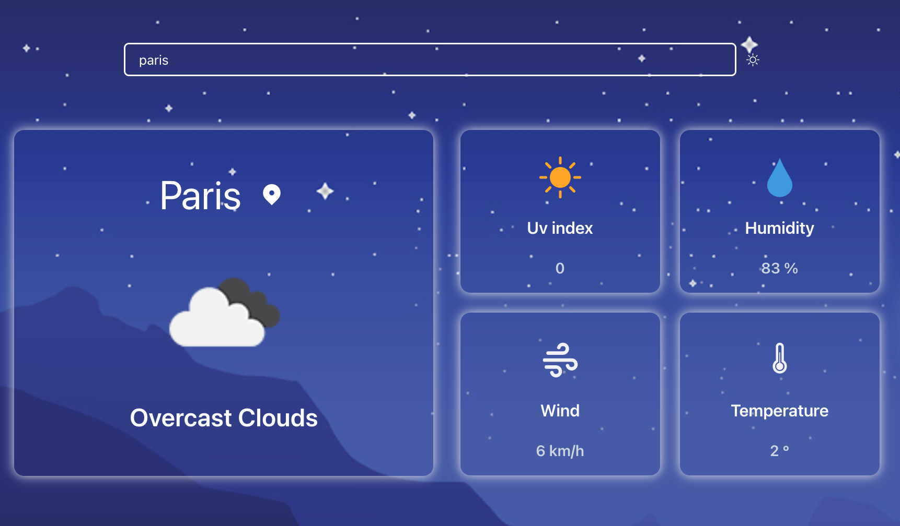

# React-Weather-Application

## Table of content

- [Description of Project](#description)
- [Link to deployed application](#link-to-deployed-page)
- [Screenshot of deployed application](#screenshot-of-deployed-page)
## Description

This app is a weather dashboard that uses OpenWeather One Call API (Links to an external site.) to retrieve weather data for cities current weather and forecast.

- When I search for a city then I am presented with current and future conditions for that city and that city is added to the search history
- When I view current weather conditions for that city then I am presented with the city name, the date, an icon representation of weather conditions, the temperature, the humidity, the wind speed, and the UV index
- When I view the UV index then I am presented with a color that indicates whether the conditions are favorable, moderate, or severe
- When I view future weather conditions for that city then I am presented with a 6-day forecast that displays the date, an icon representation of weather conditions and the temperature.

### Link to deployed page

https://simple-react-weather-app-ac.netlify.app

#### Screenshot of deployed page

